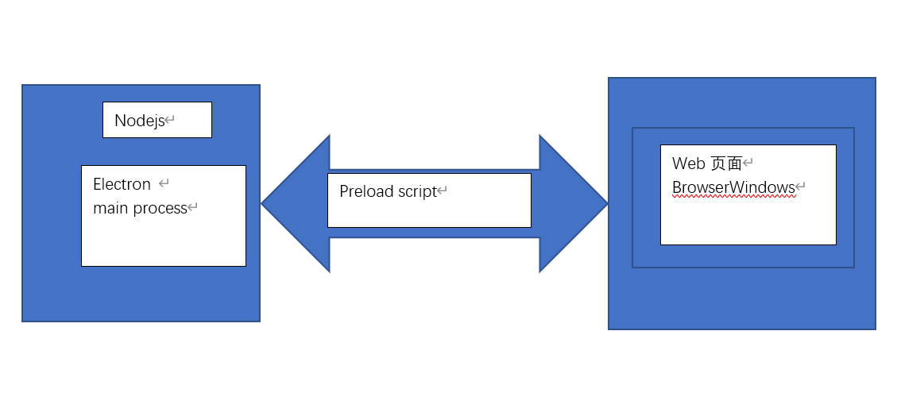

# 使用预加载脚本

## 1. 什么是预加载脚本

+ Electron 的主进程是一个拥有着**完全操作系统访问权限**的 Node.js 环境。除了 [Electron 模组](https://www.electronjs.org/zh/docs/latest/api/app) 之外，你也可以使用 [Node.js 内置模块](https://nodejs.org/dist/latest/docs/api/) 和所有通过 npm 安装的软件包。另一方面，出于安全原因，渲染进程默认跑在网页页面上，而并非 Node.js里。

  

+ **为了将 Electron 的不同类型的进程桥接在一起**，我们需要使用被称为 **预加载** 的特殊脚本。

## 2. 使用预加载脚本来增强渲染器

+ BrowserWindow 的预加载脚本运行在具有 HTML DOM 和 Node.js、Electron API 的有限子集访问权限的环境中。

+ 从 Electron 20 开始，预加载脚本默认 **沙盒化** ，不再拥有完整 Node.js 环境的访问权。 实际上，这意味着你只拥有一个 polyfilled 的 `require` 函数，这个函数只能访问一组有限的 API。。

| 可用的API          | 细节                                                         |
| ------------------ | ------------------------------------------------------------ |
| electron modules   | Renderer process modules                                     |
| Node.js modules    | [`events`](https://nodejs.org/api/events.html), [`timers`](https://nodejs.org/api/timers.html),[`url`](https://nodejs.org/api/url.html) |
| Polyfilled globals | [`Buffer`](https://nodejs.org/api/buffer.html), [`process`](https://www.electronjs.org/docs/latest/api/process), [`clearImmediate`](https://nodejs.org/api/timers.html#timers_clearimmediate_immediate),[`setImmediate`](https://nodejs.org/api/timers.html#timers_setimmediate_callback_args) |

有关详细信息，请查看[流程沙盒](https://www.electronjs.org/docs/latest/tutorial/sandbox)指南。

+ 预加载脚本像 Chrome 扩展的 [内容脚本](https://developer.chrome.com/docs/extensions/mv3/content_scripts/)（Content Script）一样，会在渲染器的网页加载之前注入。 如果你想向渲染器加入需要特殊权限的功能，你可以通过 [contextBridge](https://www.electronjs.org/zh/docs/latest/api/context-bridge) 接口定义 [全局对象](https://developer.mozilla.org/en-US/docs/Glossary/Global_object)。

+ 为了演示这一概念，你将会创建一个将应用中的 Chrome、Node、Electron 版本号暴露至渲染器的预加载脚本

+ 新建一个 `preload.js` 文件。该脚本通过 `versions` 这一全局变量，将 Electron 的 `process.versions` 对象暴露给渲染器。

  `preload.js`

  ```js
  const { contextBridge } = require("electron");
  
  contextBridge.exposeInMainWorld("versions", {
    node: () => process.version.node,
    chrome: () => process.version.chrome,
    electron: () => process.versions.electron,
     // 能暴露的不仅仅是函数，我们还可以暴露变量
  });
  ```

+ 为了将脚本附在渲染进程上，在 BrowserWindow 构造器中使用 `webPreferences.preload` 传入脚本的路径。

  `main.js`

  ```js
  const { app, BrowserWindow } = require("electron");
  const path=require('path')
  
  const createWindow = () => {
    const win = new BrowserWindow({
      width: 800,
      height: 600,
      webPreferences:path.join(__dirname,'preload.js')// 将preload 脚本附在渲染进程上,使用
      // webPreference 传入 路径
    }); // 创建一个 BrowserWindow窗口 实例
  
    win.loadFile("index.html");
  };
  console.log(process.platform, "process.platform"); // win32
  // 检查 Node.js 的 process.platform 变量，帮助您在不同操作系统上运行特定代码。
  //请注意，Electron 目前只支持三个平台：win32 (Windows), linux (Linux) 和 darwin (macOS)
  
  app.whenReady().then(() => {
    createWindow();
    app.on("activate", () => {
      if (BrowserWindow.getAllWindows().length === 0) createWindow();
    });
  });
  
  app.on("window-all-closed", () => {
    if (process.platform !== "darwin") app.quit();
  });
  ```

+ 现在渲染器能够全局访问 `versions` 了，让我们快快将里边的信息显示在窗口中。 这个变量不仅可以通过 `window.versions` 访问，也可以很简单地使用 `versions` 来访问。 新建一个 `renderer.js` 脚本， 这个脚本使用 [`document.getElementById`](https://developer.mozilla.org/en-US/docs/Web/API/Document/getElementById) DOM 接口来替换 `id` 属性为 `info` 的 HTML 元素显示文本。

  `renderer.js`

  ```c++
  const information = document.getElementById("info");
  information.innerText = `本应用正在使用的chrome版本${versions.chrome()},node版本为${versions.node()},electron的版本为${versions.electron()}`;
  console.log(versions,'versions');
  ```

  `index.html`

  ```html
  <!DOCTYPE html>
  <html>
    <head>
      <meta charset="UTF-8" />
      <!-- https://developer.mozilla.org/en-US/docs/Web/HTTP/CSP -->
      <meta
        http-equiv="Content-Security-Policy"
        content="default-src 'self'; script-src 'self'"
      />
      <meta
        http-equiv="X-Content-Security-Policy"
        content="default-src 'self'; script-src 'self'"
      />
      <title>Hello from Electron renderer!</title>
    </head>
    <body>
      <h1>Hello from Electron renderer!</h1>
      <p>👋</p>
      <p id="info"></p>
    </body>
    <script src="./renderer.js"></script>
  </html>
  ```

## 3. 在进程间进行通信

+ 我们之前提到，Electron 的主进程和渲染进程有着清楚的分工并且不可互换。 **这代表着无论是从渲染进程直接访问 Node.js 接口，亦或者是从主进程访问 HTML 文档对象模型 (DOM)，都是不可能的**。

+ **解决这一问题的方法是使用进程间通信 (IPC)**。可以使用 Electron 的 `ipcMain` 模块和 `ipcRenderer` 模块来进行进程间通信。 为了从你的网页向主进程发送消息，你可以使用 `ipcMain.handle` 设置一个主进程处理程序（handler），然后在预处理脚本中暴露一个被称为 `ipcRenderer.invoke` 的函数来触发该处理程序（handler）。

+ 我们将向渲染器添加一个叫做 `ping()` 的全局函数来演示这一点。这个函数将返回一个从主进程翻山越岭而来的字符串。

  `preload.js`

  ```js
  const { contextBridge,ipcRenderer } = require("electron");
  
  // 暴露全局变量给页面
  contextBridge.exposeInMainWorld("versions", {
    node: () => process.versions.node,
    chrome: () => process.versions.chrome,
    electron: () => process.versions.electron,
    ping:()=>ipcRenderer.invoke('ping'),
     // 能暴露的不仅仅是函数，我们还可以暴露变量
  });
  ```

+ **IPC安全**

  可以注意到我们使用了一个辅助函数来包裹 `ipcRenderer.invoke('ping')` 调用，而并非直接通过 context bridge 暴露 `ipcRenderer` 模块。 你**永远**都不会想要通过预加载直接暴露整个 `ipcRenderer` 模块。 这**将使得你的渲染器能够直接向主进程发送任意的 IPC 信息，会使得其成为恶意代码最强有力的攻击媒介**。

+ 然后，在主进程中设置你的 `handle` 监听器。 我们在 HTML 文件加载*之前*完成了这些，所以才能保证在你从渲染器发送 `invoke` 调用之前处理程序能够准备就绪。

  `main.js`

  ```js
  const { app, BrowserWindow, ipcMain } = require("electron");
  const path = require("path");
  
  const createWindow = () => {
    const win = new BrowserWindow({
      width: 800,
      height: 600,
      webPreferences: {
        preload: path.join(__dirname, "preload.js"),
      },
      // 将preload 脚本附在渲染进程上,使用
      // webPreference 传入 路径
    }); // 创建一个 BrowserWindow窗口 实例
  
    win.loadFile("index.html");
    ipcMain.handle("ping", () => "pong");// Browser向 main process通行使用ipcMain.handle 
  };
  console.log(process.platform, "process.platform"); // win32
  // 检查 Node.js 的 process.platform 变量，帮助您在不同操作系统上运行特定代码。
  //请注意，Electron 目前只支持三个平台：win32 (Windows), linux (Linux) 和 darwin (macOS)
  
  app.whenReady().then(() => {
    createWindow();
    app.on("activate", () => {
      if (BrowserWindow.getAllWindows().length === 0) createWindow();
    });
  });
  
  app.on("window-all-closed", () => {
    if (process.platform !== "darwin") app.quit();
  });
  
  ```

+ 将发送器与接收器设置完成之后，现在你可以将信息通过刚刚定义的 `'ping'` 通道从渲染器发送至主进程当中。

  `renderer.js`

  ```js
  const information = document.getElementById("info");
  information.innerText = `本应用正在使用的chrome版本${versions.chrome()},node版本为${versions.node()},electron的版本为${versions.electron()}`;
  console.log(versions,'versions');
  
  const ipcConnect=async()=>{
    const res=await window.versions.ping()
    console.log(res);// 'pong'
  }
  ipcConnect();
  ```

## 4. 摘要

预加载脚本包含在浏览器窗口加载网页之前运行的代码。 其可访问 DOM 接口和 Node.js 环境，并且经常在其中使用 `contextBridge` 接口将特权接口暴露给渲染器。

由于主进程和渲染进程有着完全不同的分工，Electron 应用通常使用预加载脚本来设置进程间通信 (IPC) 接口以在两种进程之间传输任意信息。
