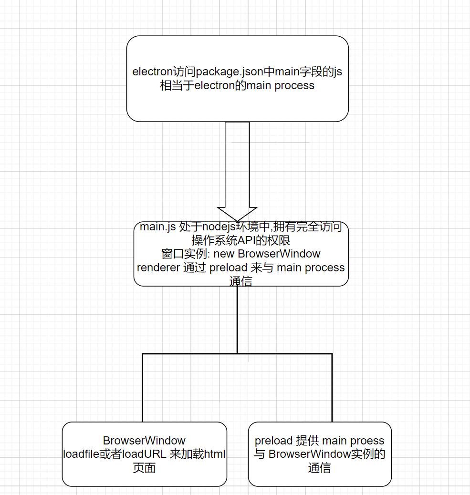
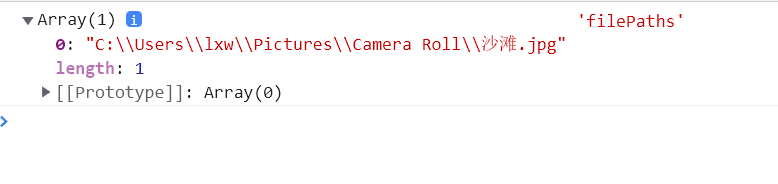

# 1. 流程模型

+ Electron 继承了来自 Chromium 的多进程架构，这使得此框架在架构上非常相似于一个现代的网页浏览器。

## 1 为什么不是一个单一的进程？

+ 网页浏览器是个极其复杂的应用程序。 除了显示网页内容的主要能力之外，他们还有许多次要的职责，例如：管理众多窗口 ( 或 标签页 ) 和加载第三方扩展。

在早期，浏览器通常使用单个进程来处理所有这些功能。 虽然这种模式意味着您打开每个标签页的开销较少，但也同时意味着一个网站的崩溃或无响应会影响到整个浏览器。

## 2 多进程模型

+ 为了解决这个问题，Chrome 团队决定让每个标签页在自己的进程中渲染， 从而限制了一个网页上的有误或恶意代码可能导致的对整个应用程序造成的伤害。 然后用单个浏览器进程控制这些标签页进程，以及整个应用程序的生命周期。 下方来自 [Chrome 漫画](https://www.google.com/googlebooks/chrome/) 的图表可视化了此模型：


+ Electron 应用程序的结构非常相似。 作为应用开发者，你**将控制两种类型的进程：[主进程](https://www.electronjs.org/zh/docs/latest/tutorial/process-model#the-main-process) 和 [渲染器进程](https://www.electronjs.org/zh/docs/latest/tutorial/process-model#the-renderer-process)。 这类似于上文所述的 Chrome 的浏览器和渲染器进程。**

## 3 主进程

+ 每个 Electron 应用都有一个单一的主进程，作为应用程序的入口点。 **主进程在 Node.js 环境中运行**，这意味着它具有 `require` 模块和使用所有 Node.js API 的能力。

## 4 窗口管理

+ 主进程的主要目的是使用 [`BrowserWindow`](https://www.electronjs.org/zh/docs/latest/api/browser-window) 模块创建和管理应用程序窗口。

+ `BrowserWindow` 类的每个实例创建一个应用程序窗口，且在单独的渲染器进程中加载一个网页。 您可从主进程用 window 的 [`webContent`](https://www.electronjs.org/zh/docs/latest/api/web-contents) 对象与网页内容进行交互。

  `main.js`

  ```js
  const { BrowserWindow } = require('electron')
  
  const win = new BrowserWindow({ width: 800, height: 1500 })
  win.loadURL('https://github.com')
  
  const contents = win.webContents
  console.log(contents)
  ```

  > 注意：渲染器进程也是为 [web embeds](https://www.electronjs.org/zh/docs/latest/tutorial/web-embeds) 而被创建的，例如 `BrowserView` 模块。 嵌入式网页内容也可访问 `webContents` 对象。

  由于 `BrowserWindow` 模块是一个 [`EventEmitter`](https://nodejs.org/api/events.html#events_class_eventemitter)， 所以您也可以为各种用户事件 ( 例如，最小化 或 最大化您的窗口 ) 添加处理程序。

  当一个 `BrowserWindow` 实例被销毁时，与其相应的渲染器进程也会被终止。

## 5 应用程序生命周期

+ 主进程还能通过 Electron 的 [`app`](https://www.electronjs.org/zh/docs/latest/api/app) 模块来控制您应用程序的生命周期。 该模块提供了一整套的事件和方法，可以让您用来添加自定义的应用程序行为 (例如：以编程方式退出您的应用程序、修改应用程序坞，或显示一个关于面板) 。

+ 这是一个实际的例子，这个app来源于[快速入门指南](https://www.electronjs.org/zh/docs/latest/tutorial/quick-start#manage-your-windows-lifecycle)，用 `app` API 创建了一个更原生的应用程序窗口体验。

  `main.js`

  ```js
  // quitting the app when no windows are open on non-macOS platforms
  app.on('window-all-closed', () => {
    if (process.platform !== 'darwin') app.quit()
  })
  ```

## 6 Native APIs

为了使 Electron 的功能不仅仅限于对网页内容的封装，**主进程也添加了自定义的 API 来与用户的作业系统进行交互。 Electron 有着多种控制原生桌面功能的模块，例如菜单、对话框以及托盘图标。**

关于 Electron 主进程模块的完整列表，请参阅我们的 API 文档。


## 7  The renderer process

+ 每个 Electron 应用都会为每个打开的 `BrowserWindow` ( 与每个网页嵌入 ) 生成一个单独的渲染器进程。 洽如其名，渲染器负责 *渲染* 网页内容。 所以实际上，运行于渲染器进程中的代码是须遵照网页标准的 (至少就目前使用的 Chromium 而言是如此) 。

+ 因此，一个浏览器窗口中的所有的用户界面和应用功能，都应与您在网页开发上使用相同的工具和规范来进行攥写。

  虽然解释每一个网页规范超出了本指南的范围，但您最起码要知道的是：

  - 以一个 HTML 文件作为渲染器进程的入口点。
  - 使用层叠样式表 (Cascading Style Sheets, CSS) 对 UI 添加样式。
  - 通过 `<script>` 元素可添加可执行的 JavaScript 代码。

  **此外，这也意味着渲染器无权直接访问 `require` 或其他 Node.js API。 为了在渲染器中直接包含 NPM 模块，必须使用与在 web 开发时相同的打包工具** (例如 `webpack` 或 `parcel`)

  相当于把一个 web项目部署在本地,然后通过nodejs来访问?

+ ```
  可以使用完整的 Node.js 环境生成渲染器进程，以便于开发。从历史上看，这曾经是默认设置，但出于安全原因，此功能已被禁用。
  ```

## 8 Preload Scripts

+ 预加载（preload）脚本包含了那些执行于渲染器进程中，且先于网页内容开始加载的代码 。 这些脚本虽运行于渲染器的环境中，却因能访问 Node.js API 而拥有了更多的权限。

+ 预加载脚本可以在 `BrowserWindow` 构造方法中的 `webPreferences` 选项里被附加到主进程。

  `main.js`

  ```js
  const win = new BrowserWindow({
      width: 800,
      height: 600,
      webPreferences: {
        preload: path.join(__dirname, "preload.js"),
      },
      // 将preload 脚本附在渲染进程上,使用
      // webPreference 传入 路径
    }); // 创建一个 BrowserWindow窗口 实例
  ```

+ 因为预加载脚本与浏览器共享同一个全局 [`Window`](https://developer.mozilla.org/en-US/docs/Web/API/Window) 接口，并且可以访问 Node.js API，所以它通过在全局 `window` 中暴露任意 API 来增强渲染器，以便你的网页内容使用。

+ 虽然预加载脚本与其所附着的渲染器在共享着一个全局 `window` 对象，但您<mark>**并不能从中直接附加任何变动到 `window` 之上**</mark>，因为 [`contextIsolation`](https://www.electronjs.org/zh/docs/latest/tutorial/context-isolation) (语境隔离)是默认的。

`preload.js`

```js
window.myAPI = {
  desktop: true,
}
```

`renderer.js`

```js
console.log(window.myAPI)
// => undefined
```

## 9 语境隔离 contextBridge

**语境隔离（Context Isolation）**意味着预加载脚本与渲染器的主要运行环境是隔离开来的，以避免泄漏任何具特权的 API 到您的网页内容代码中。

取而代之，我们將使用 [`contextBridge`](https://www.electronjs.org/zh/docs/latest/api/context-bridge) 模块来安全地实现交互：

preload.js

```js
const { contextBridge } = require('electron')

contextBridge.exposeInMainWorld('myAPI', {
  desktop: true,
})
```

renderer.js

```js
console.log(window.myAPI)
// => { desktop: true }
```

此功能对两个主要目的來說非常有用：

- 通过暴露 [`ipcRenderer`](https://www.electronjs.org/zh/docs/latest/api/ipc-renderer) 帮手模块于渲染器中，您可以使用 进程间通讯 ( inter-process communication, IPC ) 来从渲染器触发主进程任务 ( 反之亦然 ) 。
- 如果您正在为远程 URL 上托管的现有 web 应用开发 Electron 封裝，则您可在渲染器的 `window` 全局变量上添加自定义的属性，好在 web 客户端用上仅适用于桌面应用的设计逻辑 。

## 10 效率进程

+ **每个Electron应用程序都可以使用主进程生成多个子进程**[UtilityProcess](https://www.electronjs.org/zh/docs/latest/api/utility-process) API。 

  主进程在 Node.js 环境中运行，这意味着它具有 `require` 模块和使用所有 Node.js API 的能力。 

  实用程序进程可用于托管，例如：不受信任的服务， CPU 密集型任务或以前容易崩溃的组件 托管在主进程或使用Node.js[`child_process.fork`](https://nodejs.org/dist/latest-v16.x/docs/api/child_process.html#child_processforkmodulepath-args-options) API 生成的进程中。 

  效率进程和 Node 生成的进程之间的主要区别.js child_process模块是实用程序进程可以建立通信 通道与使用[`MessagePort`](https://developer.mozilla.org/en-US/docs/Web/API/MessagePort)的渲染器进程。 

  当需要从主进程派生一个子进程时，Electron 应用程序可以总是优先使用 [效率进程](https://www.electronjs.org/zh/docs/latest/api/utility-process) API 而不是Node.js [`child_process.fork`](https://nodejs.org/dist/latest-v16.x/docs/api/child_process.html#child_processforkmodulepath-args-options) API。


# 2.  Context Isolation | 上下文隔离

## 1 context ioslation

+ 上下文隔离功能将确保您的 `preload`脚本 和 Electron的内部逻辑 运行在所加载的 [`webcontent`](https://www.electronjs.org/zh/docs/latest/api/web-contents)网页 之外的另一个独立的上下文环境里。 这对安全性很重要，因为它有助于阻止网站访问 Electron 的内部组件 和 您的预加载脚本可访问的高等级权限的API 。

+ 这意味着，实际上，您的预加载脚本访问的 `window` 对象**并不是**网站所能访问的对象。 例如，如果您在预加载脚本中设置 `window.hello = 'wave'` 并且启用了上下文隔离，当网站尝试访问`window.hello`对象时将返回 undefined。

+ 自 Electron 12 以来，默认情况下已启用上下文隔离，并且它是 *所有应用程序*推荐的安全设置。

## 2 迁移

> 没有上下文隔离，从预加载脚本提供API时，经常会使用`window.X = apiObject` 那么现在呢？

## 3 之前： 上下文隔离禁用

在渲染进程中，预加载脚本暴露给已加载的页面 API 是一个常见的使用方式。 当上下文隔离时，您的预加载脚本可能会暴露一个常见的全局`window`对象给渲染进程。 此后，您可以从中添加任意的属性到预加载在脚本。

preload.js

```javascript
// 上下文隔离禁用的情况下使用预加载
window.myAPI = {
  doAThing: () => {}
}
```

`doAThing()` 函数可以在渲染进程中直接使用。

renderer.js

```javascript
// 在渲染器进程使用导出的 API
window.myAPI.doAThing()
```

## 4 之后：启用上下文隔离\

Electron 提供一种专门的模块来无阻地帮助您完成这项工作。 [`contextBridge`](https://www.electronjs.org/zh/docs/latest/api/context-bridge) 模块可以用来**安全地**从独立运行、上下文隔离的预加载脚本中暴露 API 给正在运行的渲染进程。 API 还可以像以前一样，从 `window.myAPI` 网站上访问。

preload.js

```javascript
// 在上下文隔离启用的情况下使用预加载
const { contextBridge } = require('electron')

contextBridge.exposeInMainWorld('myAPI', {
  doAThing: () => {}
})
```

renderer.js

```javascript
// 在渲染器进程使用导出的 API
window.myAPI.doAThing()
```

请阅读 `contextBridge` 的文档，以全面了解其限制。 例如，您不能在 contextBridge 中暴露原型或者 Symbol。

## 5 安全事项

+ 单单开启和使用 `contextIsolation` 并不直接意味着您所做的一切都是安全的。 例如，此代码是 **不安全的**。

`preload.js`

```javascript
// ❌ 错误使用
contextBridge.exposeInMainWorld('myAPI', {
  send: ipcRenderer.send
})
```

+ **它直接暴露了一个没有任何参数过滤的高等级权限 API** 。 这将允许任何网站发送任意的 IPC 消息，这不会是你希望发生的。 相反，暴露进程间通信相关 API 的正确方法是为每一种通信消息提供一种实现方法。

`preload.js`

```javascript
// ✅ 正确使用
contextBridge.exposeInMainWorld('myAPI', {
  loadPreferences: () => ipcRenderer.invoke('load-prefs')
})
```

## 6 与Typescript一同使用

+ 如果您正在使用 TypeScript 构建 Electron 应用程序，您需要给通过 context bridge 暴露的 API 添加类型。 渲染进程的 `window` 对象将不会包含正确扩展类型，除非给其添加了 [类型声明](https://www.typescriptlang.org/docs/handbook/declaration-files/introduction.html)。

例如，在这个 `preload.ts` 脚本中：

preload.ts

```typescript
contextBridge.exposeInMainWorld('electronAPI', {
  loadPreferences: () => ipcRenderer.invoke('load-prefs')
})
```

您可以创建一个 `renderer.d.ts` 类型声明文件，并且全局增强 `Window` 接口。

renderer.d.ts

```typescript
export interface IElectronAPI {
  loadPreferences: () => Promise<void>,
}

declare global {
  interface Window {
    electronAPI: IElectronAPI
  }
}
```

以上所做皆是为了确保在您编写渲染进程的脚本时， TypeScript 编译器将会知晓`electronAPI`合适地在您的全局`window`对象中

renderer.ts

```typescript
window.electronAPI.loadPreferences()
```

# 3. IPC(Inter-Process Communication) | 进程间通信

+ 进程间通信 (IPC) 是在 Electron 中构建功能丰富的桌面应用程序的关键部分之一。 由于主进程和渲染器进程在 Electron 的进程模型具有不同的职责，因此 IPC 是执行许多常见任务的唯一方法，例如从 UI 调用原生 API 或从原生菜单触发 Web 内容的更改。

## 0 方法总结

1. Renderer to main one-way

   + `ipcRenderer.send` 在 `preload scripts`中发送消息

   + `ipcMain.on`在`main Process`中接收(监听)消息`ipcMain.on(key,(event,payload))`

2. Renderer to main two-way

   + `ipcRenderer.invoke`在`preload scripts`中使用

   + `ipcMain.handle`在`main Process`中监听

3.  Main to render

   1. 通过Menu(`Main Process 上的`)的点击事件来触发renderer的函数变化, 

      ```js
      const menu = Menu.buildFromTemplate([
          {
            label: app.name,
            submenu: [
              {
                click: () => mainWindow.webContents.send("update-counter", 1),
                label: "Increment",
              },
              {
                click: () => mainWindow.webContents.send("update-counter", -1),
                label: "Decrement",
              },
            ],
          },
        ]);
      ```

   2. `main Process`  使用`webContent.send(key:string,payload:any)`发送消息

   3. `renderer process`使用`preload script`暴露的`ipcRenderer.on` 来接收消息

   4. `ipcMain.on`在`main Process`中接收(监听)消息`ipcMain.on(key,(event,payload))`中的`event`有方法`event.sender.send` 来回应`Main process`中的 `ipcMain.on('counter',newVal)`

      

      

   

## 1 IPC 通信

+ 在 Electron 中，进程使用 [`ipcMain`](https://www.electronjs.org/zh/docs/latest/api/ipc-main) 和 [`ipcRenderer`](https://www.electronjs.org/zh/docs/latest/api/ipc-renderer) 模块，通过开发人员定义的“通道”传递消息来进行通信。 这些通道是 **任意** （您可以随意命名它们）和 **双向** （您可以在两个模块中使用相同的通道名称）的。

## 2 模式1 : Renderer to main (one-way) | 渲染器进程到主进程（单向）

要将单向 IPC 消息从渲染器进程发送到主进程，您可以使用 [`ipcRenderer.send`](https://www.electronjs.org/zh/docs/latest/api/ipc-renderer) API 发送消息，然后使用 [`ipcMain.on`](https://www.electronjs.org/zh/docs/latest/api/ipc-main) API 接收。

+ 通常使用此模式从 Web 内容调用主进程 API。 我们将通过创建一个简单的应用来演示此模式，可以通过编程方式更改它的窗口标题。

`main.js`

```js
const { app, BrowserWindow, ipcMain } = require("electron");
const path = require("path");

function createWindow() {
  const mainWindow = new BrowserWindow({
    width: 800,
    height: 800,
    webPreferences: {
      preload: path.join(__dirname, "preload.js"),
    },
  });
  mainWindow.loadFile("index.html");
}
function handleSetTitle(event, title) {
  const webContents = event.sender;
  console.log(webContents, "webContents");
  const win = BrowserWindow.fromWebContents(webContents);
  win.setTitle(title);
}

app.whenReady().then(() => {
  //whenReady 返回 Promise<void> - 当Electron 初始化完成。 可用作检查 app.isReady() 的方便选择，假如应用程序尚未就绪，则订阅ready事件。
  createWindow();
  ipcMain.on("set-title", handleSetTitle);
  app.on("activate", () => {
    if (BrowserWindow.getAllWindows().length === 0) {
      createWindow();
    }
  });
});

app.on("window-all-closed", () => {
  if (process.platform !== "darwin") {
    app.quit();
    // app.quit 尝试关闭所有窗口 将首先发出 before-quit 事件。 如果所有窗口都已成功关闭, 则将发出 will-quit 事件, 并且默认情况下应用程序将终止。
    // 此方法会确保执行所有beforeunload 和 unload事件处理程序。 可以在退出窗口之前的beforeunload事件处理程序中返回false取消退出。
  }
});

```

`preload.js`

```js
const { contextBridge, ipcRenderer } = require("electron");

contextBridge.exposeInMainWorld("electronAPI", {
  setTitle: (title) => ipcRenderer.send("set-title", title),
});
```

`renderer.js`

```js
const setBtn = document.getElementById("btn");
const titleInput = document.getElementById("title");
setBtn.addEventListener("click", () => {
  window.electronAPI.setTitle(titleInput.value);
});
```

`index.html`

```html
<!DOCTYPE html>
<html>
  <head>
    <meta charset="UTF-8">
    <!-- https://developer.mozilla.org/en-US/docs/Web/HTTP/CSP -->
    <meta http-equiv="Content-Security-Policy" content="default-src 'self'; script-src 'self'">
    <title>Hello World!</title>
  </head>
  <body>
    Title: <input id="title"/>
    <button id="btn" type="button">Set</button>
    <script src="./renderer.js"></script>
  </body>
</html>
```


### 2.1 使用 `ipcMain.on` 监听事件

+ 在主进程中，使用 `ipcMain.on` API 在 `set-title` 通道上设置一个 IPC 监听器:

`main.js`

```js
const {app, BrowserWindow, ipcMain} = require('electron')
const path = require('path')

//...

function handleSetTitle (event, title) {
  const webContents = event.sender
  const win = BrowserWindow.fromWebContents(webContents)
  win.setTitle(title)
}

function createWindow () {
  const mainWindow = new BrowserWindow({
    webPreferences: {
      preload: path.join(__dirname, 'preload.js')
    }
  })
  mainWindow.loadFile('index.html')
}

app.whenReady().then(() => {
  ipcMain.on('set-title', handleSetTitle)
  createWindow()
}
//...
```

+ 上面的 `handleSetTitle` 回调函数有两个参数：一个 [IpcMainEvent](https://www.electronjs.org/zh/docs/latest/api/structures/ipc-main-event) 结构和一个 `title` 字符串。 每当消息通过 `set-title` 通道传入时，此函数找到附加到消息发送方的 BrowserWindow 实例，并在该实例上使用 `win.setTitle` API。

###  2.2  通过预加载脚本暴露 `ipcRenderer.send`

+ 要将消息发送到上面创建的监听器，您可以使用 `ipcRenderer.send` API。 默认情况下，渲染器进程没有权限访问 Node.js 和 Electron 模块。 作为应用开发者，您需要使用 `contextBridge` API 来选择要从预加载脚本中暴露哪些 API。

+ 在您的预加载脚本中添加以下代码，向渲染器进程暴露一个全局的 `window.electronAPI` 变量。

  `preload.js`

  ```js
  const { contextBridge, ipcRenderer } = require('electron')
  
  contextBridge.exposeInMainWorld('electronAPI', {
      setTitle: (title) => ipcRenderer.send('set-title', title)
  })
  ```

+ 此时，您将能够在渲染器进程中使用 `window.electronAPI.setTitle()` 函数。

+ 出于 [安全原因](https://www.electronjs.org/zh/docs/latest/tutorial/context-isolation#security-considerations)，electron不会直接暴露整个 `ipcRenderer.send` API。 确保尽可能限制渲染器对 Electron API 的访问。

### 2.3  构建渲染器进程 UI

+ 在 BrowserWindow(**在main.js文件中加载BrowserWindow,package.json中的main字段加载main.js**) 加载的我们的 HTML 文件中，添加一个由文本输入框和按钮组成的基本用户界面：



`index.html`

```html
!DOCTYPE html>
<html>
  <head>
    <meta charset="UTF-8">
    <!-- https://developer.mozilla.org/en-US/docs/Web/HTTP/CSP -->
    <meta http-equiv="Content-Security-Policy" content="default-src 'self'; script-src 'self'">
    <title>Hello World!</title>
  </head>
  <body>
    Title: <input id="title"/>
    <button id="btn" type="button">Set</button>
    <script src="./renderer.js"></script>
  </body>
</html>
```


+ 为了使这些元素具有交互性，我们将在导入的 `renderer.js` 文件中添加几行代码，以利用从预加载脚本中暴露的 `window.electronAPI` 功能：

`renderer.js (Renderer Process)`

```js
const setButton = document.getElementById('btn')
const titleInput = document.getElementById('title')
setButton.addEventListener('click', () => {
    const title = titleInput.value
    window.electronAPI.setTitle(title)
});
```


## 3 Renderer to main(two-way) | 渲染器进程到主进程（双向）

+ 双向 IPC 的一个常见应用是从渲染器进程代码调用主进程模块并等待结果。 这可以通过将 [`ipcRenderer.invoke`](https://www.electronjs.org/zh/docs/latest/api/ipc-renderer#ipcrendererinvokechannel-args) 与 [`ipcMain.handle`](https://www.electronjs.org/zh/docs/latest/api/ipc-main#ipcmainhandlechannel-listener) 搭配使用来完成。

### 3.1  使用 `ipcMain.handle` 监听事件

+ 在主进程中，我们将创建一个 `handleFileOpen()` 函数，它调用 `dialog.showOpenDialog` 并返回用户选择的文件路径值。 每当渲染器进程通过 `dialog:openFile` 通道发送 `ipcRender.invoke` 消息时，此函数被用作一个回调。 然后，返回值将作为一个 Promise 返回到最初的 `invoke` 调用。

+ 关于错误处理
  + **在主进程中通过 `handle` 引发的错误是不透明的**，因为它们被序列化了，并且只有原始错误的 `message` 属性会提供给渲染器进程。
+ 关于通道名称
  + IPC 通道名称上的 `dialog:` 前缀对代码没有影响。 它仅用作命名空间以帮助提高代码的可读性。

`main.js(Main Process)`

```js
const { app, BrowserWindow, ipcMain, dialog } = require("electron");
const path = require("path");
// ...
async function handleFileOpen() {
  const { canceled, filePaths } = await dialog.showOpenDialog();
  if (canceled) {
    return;
  } else {
    return filePaths;
  }
}

app.whenReady().then(() => {
  //whenReady 返回 Promise<void> - 当Electron 初始化完成。 可用作检查 app.isReady() 的方便选择，假如应用程序尚未就绪，则订阅ready事件。
  createWindow();
  ipcMain.handle("dialog:openFile", handleFileOpen);
    // PC 通道名称上的 `dialog:` 前缀对代码没有影响。 它仅用作命名空间以帮助提高代码的可读性。
  app.on("activate", () => {
    if (BrowserWindow.getAllWindows().length === 0) {
      createWindow();
    }
  });
});
// ...
```

###  3.2  通过`prelaod scripts`预加载脚本暴露`ipcRenderer.invoke`

在预加载脚本中，我们暴露了一个单行的 `openFile` 函数，它调用并返回 `ipcRenderer.invoke('dialog:openFile')` 的值。 我们将在下一步中使用此 API 从渲染器的用户界面调用原生对话框。

`preload.js(Preload Scripts)`

```c++
const { contextBridge, ipcRenderer } = require('electron')

contextBridge.exposeInMainWorld('electronAPI', {
  openFile: () => ipcRenderer.invoke('dialog:openFile')
})
```

+ 出于 [安全原因](https://www.electronjs.org/zh/docs/latest/tutorial/context-isolation#security-considerations)，我们不会直接暴露整个 `ipcRenderer.invoke` API。 确保尽可能限制渲染器对 Electron API 的访问。

### 3.3  构建渲染器进程 UI

最后，构建加载到 BrowserWindow 中的 HTML 文件。

`index.html(main.js 中的loadfile('index.html'))`

```html
<!DOCTYPE html>
<html>
  <head>
    <meta charset="UTF-8">
    <!-- https://developer.mozilla.org/en-US/docs/Web/HTTP/CSP -->
    <meta http-equiv="Content-Security-Policy" content="default-src 'self'; script-src 'self'">
    <title>Dialog!</title>
  </head>
  <body>
    <button type="button" id="btn">Open a File</button>
    File path: <strong id="filePath"></strong>
    <script src="./renderer.js"></script>
  </body>
</html>
```

用户界面包含一个 `#btn` 按钮元素，将用于触发我们的预加载 API，以及一个 `#filePath` 元素，将用于显示所选文件的路径。 要使这些部分起作用，需要在渲染器进程脚本中编写几行代码：

`renderer.js (Renderer Process)`

```js
const setBtn = document.getElementById("btn");
const titleInput = document.getElementById("filePaths");
setBtn.addEventListener("click", async () => {
  const filePaths = await window.electronAPI.openFile();
  console.log(filePaths, "filePaths");
});
```

!]

+ 在上面的代码片段中，监听 `#btn` 按钮的点击，并调用 `window.electronAPI.openFile()` API 来激活原生的打开文件对话框。 

### 3.4 注意：对于旧方法

+ `ipcRenderer.invoke` API 是在 Electron 7 中添加的，作为处理渲染器进程中双向 IPC 的一种开发人员友好的方式。 但这种 IPC 模式存在几种替代方法。

+ 如果可能，请避免使用旧方法

+ 我们建议尽可能使用 `ipcRenderer.invoke` 。 出于保留历史的目地，记录了下面双向地渲染器到主进程模式。

对于以下示例，我们将直接从预加载脚本调用 `ipcRenderer`，以保持代码示例短小。

#### 1. 使用 `ipcRenderer.send`[](https://www.electronjs.org/zh/docs/latest/tutorial/ipc#使用-ipcrenderersend)

+ 用于单向通信的 `ipcRenderer.send` API 也可用于双向通信。 这是在 Electron 7 之前通过 IPC 进行异步双向通信的推荐方式。

preload.js (Preload Script)

```javascript
// 您也可以使用 `contextBridge` API
// 将这段代码暴露给渲染器进程
const { ipcRenderer } = require('electron')

ipcRenderer.on('asynchronous-reply', (_event, arg) => {
  console.log(arg) // 在 DevTools 控制台中打印“pong”
})
ipcRenderer.send('asynchronous-message', 'ping')
```

main.js (Main Process)

```javascript
ipcMain.on('asynchronous-message', (event, arg) => {
  console.log(arg) // 在 Node 控制台中打印“ping”
  // 作用如同 `send`，但返回一个消息
  // 到发送原始消息的渲染器
  event.reply('asynchronous-reply', 'pong')
})
```

这种方法有几个缺点：

- 需要设置第二个 `ipcRenderer.on` 监听器来处理渲染器进程中的响应。 使用 `invoke`，将获得作为 Promise 返回到原始 API 调用的响应值。
- 没有显而易见的方法可以将 `asynchronous-reply` 消息与原始的 `asynchronous-message` 消息配对。 如果通过这些通道非常频繁地来回传递消息，则需要添加其他应用代码来单独跟踪每个调用和响应。

#### 2. 使用 `ipcRenderer.sendSync`

`ipcRenderer.sendSync` API 向主进程发送消息，并 ***同步*** 等待响应。

main.js (Main Process)

```javascript
const { ipcMain } = require('electron')
ipcMain.on('synchronous-message', (event, arg) => {
  console.log(arg) // 在 Node 控制台中打印“ping”
  event.returnValue = 'pong'
})
```

preload.js (Preload Script)

```javascript
// 您也可以使用 `contextBridge` API
// 将这段代码暴露给渲染器进程
const { ipcRenderer } = require('electron')

const result = ipcRenderer.sendSync('synchronous-message', 'ping')
console.log(result) // 在 DevTools 控制台中打印“pong”
```

这份代码的结构与 `invoke` 模型非常相似，但出于性能原因，建议**避免使用此 API**。 它的**同步特性意味着它将<mark>阻塞渲染器进程</mark>，直到收到回复为止。**

### 4. Main to renderer | 主进程到渲染器进程

+ 将消息从主进程发送到渲染器进程时，需要指定是哪一个渲染器接收消息。 消息需要通过其 [`WebContents`](https://www.electronjs.org/zh/docs/latest/api/web-contents) 实例发送到渲染器进程。 此 WebContents 实例包含一个 [`send`](https://www.electronjs.org/zh/docs/latest/api/web-contents#contentssendchannel-args) 方法，其使用方式与 `ipcRenderer.send` 相同。

+ 为了演示此模式，我们将构建一个由原生操作系统菜单控制的数字计数器。

### 1. 使用 `webContents` 模块发送消息

对于此演示，我们需要首先使用 Electron 的 `Menu` 模块在主进程中构建一个自定义菜单，该模块使用 `webContents.send` API 将 IPC 消息从主进程发送到目标渲染器。

`main.js(Main Process)`

```js
const {app, BrowserWindow, Menu, ipcMain} = require('electron')
const path = require('path')

function createWindow () {
  const mainWindow = new BrowserWindow({
    webPreferences: {
      preload: path.join(__dirname, 'preload.js')
    }
  })

  const menu = Menu.buildFromTemplate([
    {
      label: app.name,
      submenu: [
        {
          click: () => mainWindow.webContents.send('update-counter', 1),
          label: 'Increment',
        },
        {
          click: () => mainWindow.webContents.send('update-counter', -1),
          label: 'Decrement',
        }
      ]
    }
  ])
  Menu.setApplicationMenu(menu)

  mainWindow.loadFile('index.html')
}
//...
```

请务必注意， `click` 处理函数通过 `update-counter` 通道向渲染器进程发送消息（`1` 或 `-1`）。

```js
click: () => mainWindow.webContents.send('update-counter', -1)
```

### 2. 通过预加载脚本暴露 `ipcRenderer.on`

与前面的渲染器到主进程的示例一样，我们使用预加载脚本中的 `contextBridge` 和 `ipcRenderer` 模块向渲染器进程暴露 IPC 功能：

`preload.js`

```js
const { contextBridge, ipcRenderer } = require("electron");


// 暴露handleCounter 这个方法给 renderer process
contextBridge.exposeInMainWorld("electronAPI", {
  handleCounter: (callback) => ipcRenderer.on("update-counter", callback),
});

```

+ 加载预加载脚本后，渲染器进程应有权访问 `window.electronAPI.onUpdateCounter()` 监听器函数。

+ 在这个最小示例中，您可以直接在预加载脚本中调用 `ipcRenderer.on` ，而不是通过 context bridge 暴露它。

  preload.js (Preload Script)

  ```javascript
  const { ipcRenderer } = require('electron')
  
  window.addEventListener('DOMContentLoaded', () => {
      const counter = document.getElementById('counter')
      ipcRenderer.on('update-counter', (_event, value) => {
          const oldValue = Number(counter.innerText)
          const newValue = oldValue + value
          counter.innerText = newValue
      })
  })
  ```

  + 但是，与通过 context bridge 暴露预加载 API 相比，此方法的灵活性有限，因为监听器无法直接与渲染器代码交互。

### 3. 构建渲染器进程 UI

为了将它们联系在一起，我们将在加载的 HTML 文件中创建一个接口，其中包含一个 `#counter` 元素，我们将使用该元素来显示值：

index.html

```html
<!DOCTYPE html>
<html>
  <head>
    <meta charset="UTF-8">
    <!-- https://developer.mozilla.org/en-US/docs/Web/HTTP/CSP -->
    <meta http-equiv="Content-Security-Policy" content="default-src 'self'; script-src 'self'">
    <title>Menu Counter</title>
  </head>
  <body>
    Current value: <strong id="counter">0</strong>
    <script src="./renderer.js"></script>
  </body>
</html>
```


最后，为了更新 HTML 文档中的值，我们将添加几行 DOM 操作的代码，以便在每次触发 `update-counter` 事件时更新 `#counter` 元素的值。

renderer.js (Renderer Process)

```javascript
const counter=document.getElementById('counter')

window.electronAPI.handleCounter((_event,value)=>{
  const oldValue=Number(counter.innerText)
  const newVal=oldValue+value
  counter.innerText=newVal
  _event.sender.send('counter-value',newVal)
})
```


在上面的代码中，我们将回调传递给从预加载脚本中暴露的 `window.electronAPI.onUpdateCounter` 函数。 第二个 `value` 参数对应于我们传入 `webContents.send` 函数的 `1` 或 `-1`，该函数是从原生菜单调用的。

### 4. 可选：返回一个回复

对于从主进程到渲染器进程的 IPC，没有与 `ipcRenderer.invoke` 等效的 API。 不过，您可以从 `ipcRenderer.on` 回调中将回复发送回主进程。

我们可以对前面例子的代码进行略微修改来演示这一点。 在渲染器进程中，使用 `event` 参数，通过 `counter-value` 通道将回复发送回主进程。

renderer.js (Renderer Process)

```javascript
const counter = document.getElementById('counter')

window.electronAPI.onUpdateCounter((event, value) => {
  const oldValue = Number(counter.innerText)
  const newValue = oldValue + value
  counter.innerText = newValue
  event.sender.send('counter-value', newValue)
})
```


在主进程中，监听 `counter-value` 事件并适当地处理它们。

main.js (Main Process)

```javascript
//...
ipcMain.on('counter-value', (_event, value) => {
  console.log(value) // 将打印到 Node 控制台
})
//...
```

## 4. Renderer to renderer | 渲染器进程到渲染器进程

没有直接的方法可以使用 `ipcMain` 和 `ipcRenderer` 模块在 Electron 中的渲染器进程之间发送消息。 为此，您有两种选择：

- 将主进程作为渲染器之间的消息代理。 这需要将消息从一个渲染器发送到主进程，然后主进程将消息转发到另一个渲染器。
- 从主进程将一个 [MessagePort](https://www.electronjs.org/zh/docs/latest/tutorial/message-ports) 传递到两个渲染器。 这将允许在初始设置后渲染器之间直接进行通信。

## 5. 对象序列化

+ Electron 的 IPC 实现使用 HTML 标准的 [结构化克隆算法](https://developer.mozilla.org/en-US/docs/Web/API/Web_Workers_API/Structured_clone_algorithm) 来**序列化进程之间传递的对象**，这意味着只有某些类型的对象可以通过 IPC 通道传递。

+ 特别是 DOM 对象（例如 `Element`，`Location` 和 `DOMMatrix`），**Node.js 中由 C++ 类支持的对象（例如 `process.env`，`Stream` 的一些成员）和 Electron 中由 C++ 类支持的对象（例如 `WebContents`、`BrowserWindow` 和 `WebFrame`）无法使用结构化克隆序列化。**


# 4.  Process Sandboxing | 进程沙盒化

## 1. Electron 中的沙盒行为

+ 在 Electron 中沙盒进程 *大部分地* 表现都与 Chromium 差不多， 但因为介面是 Node.js 的关系 Electron 有一些额外的概念需要考虑。

## 2. 渲染器进程

+ 当 Electron 中的渲染进程被沙盒化时，它们的行为与常规 Chrome 渲染器一样。 一个沙盒化的渲染器不会有一个 Node.js 环境。

+ 因此，在沙盒中，渲染进程只能透过 进程间通讯 (inter-process communication, IPC) 委派任务给主进程的方式， 来执行需权限的任务 (例如：文件系统交互，对系统进行更改或生成子进程) 。

## 3. Preload 脚本

+ 为了让渲染进程能与主进程通信，附属于沙盒化的渲染进程的 preload 脚本中仍可使用一部分以 Polyfill 形式实现的 Node.js API。 有一个与 Node 中类似的 `require` 函数提供了出来，但只能载入 Electron 和 Node 内置模块的一个子集：

  - `electron` (仅限渲染器进程模块)

  - [`事件`](https://nodejs.org/api/events.html)

  - [`timers`](https://nodejs.org/api/timers.html)

  - [`url`](https://nodejs.org/api/url.html)

+ 此外，以下 Node.js 基础对象也填充到了 preload 脚本的全局上下文中：

  - [`Buffer`](https://nodejs.org/api/buffer.html)

  - [`process`](https://www.electronjs.org/zh/docs/latest/api/process)

  - [`clearImmediate`](https://nodejs.org/api/timers.html#timers_clearimmediate_immediate)

  - [`setImmediate`](https://nodejs.org/api/timers.html#timers_setimmediate_callback_args)

+ `require` 函数只是一个功能有限的 Ployfill 实现，并不支持把 preload 脚本拆成多个文件然后作为 [CommonJS 模块](https://nodejs.org/api/modules.html#modules_modules_commonjs_modules) 来加载。 若需要拆分 preload 脚本的代码，可以使用 [webpack](https://webpack.js.org/) 或 [Parcel](https://parceljs.org/) 等打包工具。

+ 注意，因为 `preload` 脚本的运行环境本质上比沙盒化渲染进程的拥有更高的特权，除非开启了 [`contextIsolation`](https://www.electronjs.org/zh/docs/latest/tutorial/context-isolation)，否则高特权的 API 仍有可能被泄漏给渲染进程中的不信任代码。

## 4. 配置沙盒

### 1. 为单个进程禁用沙盒

+  renderer process中的沙盒禁用

`main.js`

```js
app.whenReady().then(() => {
  const win = new BrowserWindow({
    webPreferences: {
      sandbox: true
    }
  })
  win.loadURL('https://google.com')
})
```

+ node的沙盒禁用

```js
app.whenReady().then(() => {
  const win = new BrowserWindow({
    webPreferences: {
      nodeIntegration: true
    }
  })
  win.loadURL('https://google.com')
})
```

### 2. 全局启用沙盒

+ 可以调用 [`app.enableSandbox`](https://www.electronjs.org/zh/docs/latest/api/app#appenablesandbox) API 来强制沙盒化所有渲染器。 注意，此 API 必须在应用的 `ready` 事件之前调用。

  `main.js`

  ```js
  app.enableSandbox()
  app.whenReady().then(() => {
    // any sandbox:false calls are overridden since `app.enableSandbox()` was called.
    const win = new BrowserWindow()
    win.loadURL('https://google.com')
  })
  ```


# 5.  MessagePorts in Electron |electron中的消息端口

+ [`MessagePort`](https://developer.mozilla.org/en-US/docs/Web/API/MessagePort)是一个允许在不同上下文之间传递消息的Web功能。 就像 `window.postMessage`, 但是在不同的通道上。

## 1. 主进程中的 MessagePorts

+ 在渲染器中， `MessagePort` 类的行为与它在 web 上的行为完全一样。 但是，主进程不是网页（它没有 Blink 集成），因此它没有 `MessagePort` 或 `MessageChannel` 类。 为了在主进程中处理 MessagePorts 并与之交互，Electron 添加了两个新类： [`MessagePortMain`](https://www.electronjs.org/zh/docs/latest/api/message-port-main) 和 [`MessageChannelMain`](https://www.electronjs.org/zh/docs/latest/api/message-channel-main)。 这些行为 类似于渲染器中 analogous 类。

+ `MessagePort` 对象可以在渲染器或主 进程中创建，并使用 [`ipcRenderer.postMessage`](https://www.electronjs.org/zh/docs/latest/api/ipc-renderer#ipcrendererpostmessagechannel-message-transfer) 和 [`WebContents.postMessage`](https://www.electronjs.org/zh/docs/latest/api/web-contents#contentspostmessagechannel-message-transfer) 方法互相传递。 请注意，通常的 IPC 方法，例如 `send` 和 `invoke` 不能用来传输 `MessagePort`, 只有 `postMessage` 方法可以传输 `MessagePort`。

+ 通过主进程传递 `MessagePort`，就可以连接两个可能无法通信的页面 (例如，由于同源限制) 。
